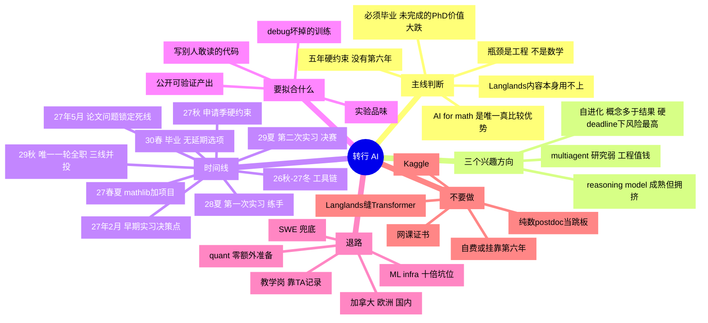

昨天推了一天转行路线，今天问了 DGS，拿到一个会改变结构的答案：**第六年没有 funding**。下面是把这件事灌进去之后重推的版本，不是原稿。

> [!abstract] 一句话
> 接下来 12 个月只需要做对两件事：**让论文问题变得可控**，以及**从不会写工程代码变成能提 PR**。其余都是次要的。现在要补一句：这两件事都没有第二次机会。

**基线**：2025-09 入学，funding 五年，**第六年没钱（2026-09-08 问过 DGS，已确认）**。2030 春毕业从"预计"变成**硬 deadline**。现在博二第一学期，方向 relative Langlands。

> [!danger] 没有第六年，到底改了什么
> 1. **延毕不再是缓冲，是财务事故。** 原方案里"relative Langlands 拖到六年很常见"是一块隐含的安全垫，这块垫子撤了。
> 2. **论文选题从"重要"升到第一优先级。** 选一个需要新想法的开放猜想，等于把毕业时间交给运气。
> 3. **"延一年再申一轮"这条退路被删掉了。** 这是求职失败后最常用的补救动作。2029 秋那一轮就是唯一一轮。
> 4. **2029 夏必须当转正来打。** 原来是"两次实习，第一次可以打差一点的"，现在实际是"一次练手 + 一次决赛"。
> 5. **探索型方向的成本上升。** 自进化那种"做一年发现在追一个测不准的东西"，以前是浪费，现在是致命。

---

## 骨架图

---

## 一、方向判断

- **reasoning model**
    - 最成熟也最拥挤，RLVR 范式已定型
    - 真前沿：可验证域之外的 reward 设计、test-time compute 成本、RL 是教新能力还是 elicit 已有分布（至今无干净答案）
    - 有饭吃，但核心竞争是算力，外部单干难
- **AI 自进化**
    - 三样不同的东西被一个词包住，价值差别大
    - self-play / 自训练：争议大，收益常来自 verifier 而非"自我改进"，复现性差
    - automated curriculum：中等
    - 用 AI 自动化 AI 研究：真正的硬骨头，各家 lab 头号优先级，safety-sensitive
    - 风险：做一年发现在追一个测不准的东西。**五年制里这一年是 20% 的总预算**，原来能吃下，现在吃不下
- **multi-agent**
    - 研究：23–24 那批论文多数经不起 compute-matched baseline
    - 工程：编排、上下文管理、长程可靠性、错误恢复 —— 工业界最缺人的地方之一
    - 结论：**当论文选题一般，当技能栈很值钱**

> [!important] AI for math 是例外
> Lean / mathlib / autoformalization / 自动定理证明。这圈里多数人懂竞赛数学，不懂现代代数几何语言。形式化同时逼你补工程：大型代码库、版本控制、review 流程。
> 代价：领域小，headcount 有限。**当入口，不当唯一出路。**
> 硬 deadline 下它的相对权重还涨了：产出是增量的（一个 PR 就是一个 PR），不像研究项目那样可能一年后归零。

---

## 二、时间线

| 时段 | 数学 : AI | 关键产出 |
|---|---|---|
| 2026-09 → 2026-12 | 8 : 2 | 工具链跑通、nanoGPT 从零、复现 2–3 篇 |
| 2027-01 → 2027-02 | 7 : 3 | **决策点**：投不投 startup 的 27 暑期实习 |
| 2027-03 → 2027-05 | 7 : 3 | **论文问题锁定的最晚期限** |
| 2027-06 → 2027-08 | 6 : 4 | mathlib 5–10 个 merged PR + 独立项目，作品集定稿 |
| 2027-09 → 2027-12 | 6 : 4 | **申请季**，投 30–50 家 |
| 2028 夏 | — | 第一次实习（练手，可以打差的） |
| 2028-09 → 2029-05 | 5 : 5 | 论文主体必须成型，不是"推进" |
| 2029 夏 | — | **第二次实习 = 决赛**，目标转正 |
| 2029-09 → 2030-05 | 3 : 7 | 论文收尾 + **唯一一轮全职申请，三线并投** |

### 几个容易踩空的机制

- **暑期实习提前一年申请**。想要 2028 夏，2027 年 9 月就得投 → 作品集 deadline 是 **2027-08**，也就是 11 个月后
- **startup 招聘窗口在 2–4 月**，比大厂晚。这是 2027 年 2 月那个决策点的由来。命中的话整条路径提前一年 —— **在硬 deadline 下这条价值上升了**：等于把决赛从 2029 夏挪到 2028 夏，凭空多一次重试
- **三个暑假，但只有两次半机会**。2027 夏（可选，靠 startup 窗口）、2028 夏（练手）、2029 夏（决赛）。没有 2030 夏。缓冲比原来估的薄一档
- **论文问题的 18 个月惯性**（新增，最要命的一条）。一旦投进去就换不了。要在 2030-05 前写完，问题必须 **2027 年 5 月前**锁定；拖到博三下学期（2028-05）才定，+18 个月就是 2029 年底，只剩半年同时收论文和跑全职申请。这是最典型的延毕路径，而延毕现在没钱

---

## 三、要拟合什么

> [!warning] 核心问题
> 现在的训练分布和评估分布几乎不重叠。日常做的事（读 BZSV、抽象推导、单人作战）在目标 loss 里权重接近零。**要换数据，不是加数据。**

按权重排：

1. **能写别人敢读的代码** —— 陌生大型代码库里定位、修改、提 PR
2. **能 debug 一个悄悄坏掉的训练** —— loss 不降时的排查顺序。这条筛掉的人最多
3. **实验品味** —— 看到现象知道下一个跑什么、切掉哪个变量
4. **公开可验证的产出** —— 他们只信 commit history 和能跑的东西

前三条靠反复训练，第四条是前三条的证据。**mathlib 一次同时优化四项。**

### 招聘档位

- **Research Scientist**：要 NeurIPS/ICML/ICLR 一作 + 连贯研究故事。没 ML 论文基本进不去，别当默认目标
- **Research Engineer / MTS** ← **靶子**。代码筛 → DL 原理深挖 → 训练推理系统设计 → 拿你的项目往死里问
- **Applied ML / ML Infra**：headcount 最大，最像 SWE，可接受的兜底

### 明确不做

- [ ] ~~网课和证书~~ 零权重
- [ ] ~~Kaggle~~
- [ ] ~~外部单干 crowded 方向的 NeurIPS 一作~~ 在跟算力多两个数量级的团队抢同一个坑
- [ ] ~~每天刷 arXiv 当学习~~ 会写代码之前边际收益很低
- [ ] ~~"Langlands + Transformer" 缝合项目~~ 两个社区都不认

---

## 四、欧洲 / postdoc 路线

### 纯数 postdoc 当跳板：性价比更差了

- 不解决核心短板，反而锁死 2–3 年继续做无关的事
- 叙事变差：直接转 = 转行者；postdoc 后转 = 学术失败者
- **新增**：五年制下 postdoc 申请季（2029 秋）和唯一一轮全职申请季完全重叠。原来还能"博四投工业、博五投 postdoc"错开，现在只能二选一，或者两边都做成半吊子
- **唯一合理版本**：保底而非计划。2029 秋主投工业，低成本顺手投几个

### 例外：AI for math 方向的 postdoc

- Lean / formalization 相关的组、围绕 mathlib 的资助、lab 的 math-focused 岗
- 同时积累 AI 简历 + 保留学术身份，天然需要懂现代数学的人
- 坑少，要求博士期间已有 formalization 实绩
- → **mathlib PR 的第二个用途**：同一动作打开两条路。在只有一轮申请的前提下，"一个动作覆盖两个市场"的东西优先级最高

### 欧洲市场结构

- **签证是真优势**：Blue Card / Chancenkarte / 荷兰 highly skilled / 法国 Passeport Talent，不用抽签
- **市场小**：伦敦（中心，但脱欧后独立体系，Global Talent visa 对博士友好）、巴黎、苏黎世（薪资最高）、阿姆斯特丹/柏林/慕尼黑（偏应用）
- **薪资通常是美国一半左右**，苏黎世例外。这是主要代价，不是签证
- 欧洲 RS 岗更看重发表（很多组学术传统出身），工程岗则与美国类似

---

## 五、退路（按失败程度分层）

> [!note] 先定义失败
> 真失败 = 2030 毕业时既无 offer 也无作品集。
> 拿到二线公司 ML/agent 工程岗 = **median outcome，不是失败**。误判这一点会导致糟糕的补救决策。

- **第一层 · 仍在 AI 附近**
    - quant（Jane Street / Citadel / Two Sigma / Jump / HRT）：主动招纯数博士，薪资常高于 AI 研究岗；代价是可迁移性差
    - ML infra / 平台：headcount 十倍于研究岗，mathlib 直接对口，可内部转研究
    - AI for science：竞争比 LLM 方向小一个量级
    - national labs / IDA-CCR：通常需公民身份
- **第二层 · 换地理**
    - 加拿大：GTS 两周下签，永居路径远优于美国；多伦多、蒙特利尔
    - 国内：DeepSeek / 月之暗面 / 智谱 / 千问 / 字节 Seed，对数学博士接受度高，AI for math 投入不小。**成功概率显著高于美国路线**
    - 新加坡、以色列、日本
- **第三层 · 留在数学换赛道**
    - 教学岗（SLAC / community college）：竞争远小于研究型 TT，**依赖 TA 记录，所以现在别敷衍 TA**
    - 顶尖高中 / 竞赛教育 / 国际学校
- **第四层 · 兜底**
    - SWE：mathlib 做扎实后你就是"能写代码的人"，市场大两个数量级

> [!tip] 关键结构（已修正）
> 几乎所有退路都被同一批动作覆盖：**工程能力 + 公开产出 + 不搞砸教学和人际关系**。不需要为失败单独准备。
> 但**执行方式要改**：原来可以串行试（美国不行再试国内），没有第六年之后必须**并投**——2029 秋第一天就三线同时发，因为没有"看完一轮反馈再补投"的时间预算。

---

## 六、止损点

- **2027 年 5 月**（新增，也是最重要的一个）：论文问题仍未锁定 → 立刻和导师摊牌，明确说"我五年必须毕业"。这个点决定的是**有没有博士学位**，比后面两个决定"去哪工作"的点重要一个量级
- **2028 年底**：实习完全没拿到 → 作品集不够硬，还有一年半补救。加大 quant + infra 投入，降低研究岗预期
- **2029 年 9 月**（从"2029 年底"提前）：不能等反馈了。美国 AI 研究岗 / quant / 加拿大 + 国内，第一天就并投

> [!danger] 真正该防的
> 不是"进不了 frontier lab"，是**在博四博五因焦虑做出锁死自己的决定**（二次 PhD、纯数 postdoc）。
> 没有第六年之后多一条：**为了多争取时间去自费或挂靠留第六年**。那是用真金白银买一个本该在 2027 年靠选题解决的问题——真到那一步，说明 2027 年 5 月那个止损点已经失守了。

---

## 七、变量状态

> [!success] 已确认（2026-09-08）
> **第六年没有 funding。** 五年就是五年。真要留第六年只能靠系外 TA / 自费 / 挂靠，成本极高——规划时当它不存在。
> 顺带值一封邮件的成本：系里有没有 dissertation completion fellowship 之类的东西。不指望，但问一句是免费的。

剩下三条未确认，按新优先级排：

- [ ] **论文问题何时锁定**（升到第一位）—— 博二是问题选择窗口，一旦投进 18 个月就换不了。硬期限是 **2027-05**。要引导导师给**有明确终点线**的问题（已知方法能推到的 case / 计算 / 特例验证），不是需要新想法的开放猜想。理由现在可以说得更直接："系里第六年没有 funding，我需要一个能确保五年内写完的题"——这是事实，导师没法反驳，也比说"想早点心里踏实"有力得多
- [ ] **TA 负担有多重** —— 每周 8–10 小时 AI 时间若是"剩下的时间"，实际会是零。必须固定时段、写进日历、优先级高于回邮件
- [ ] **护照 / 签证** —— 若国际学生：CPT 提前一学期问 OIS；很多 startup 不 sponsor H-1B，选公司时要预筛；O-1 材料从现在攒（审稿留记录）；STEM OPT 三年从 2030 春起算，别浪费。**毕业时间固定之后，整条签证时间线也跟着固定了，可以现在就往后倒排**

---

## 八、近三个月 TODO

- [x] ~~问 DGS 第六年 funding~~ → 已问，答案是**没有**
- [ ] 和导师谈论文问题范围，**明确告知"五年必须毕业"这个约束**，争取"有终点线"的题
- [ ] 顺手问系里有没有 dissertation completion fellowship / 系外 TA line
- [ ] 在日历上把 **2027-05（选题锁定）** 和 **2027-08（作品集定稿）** 标成硬事件，不是软目标
- [ ] 申请 JHU 集群账号，另备几百刀租卡预算
- [ ] 从零写 GPT 并训起来，每行能解释
- [ ] 复现 2–3 篇论文（是复现，不是读）
- [ ] 基建：git 工作流 / docker / wandb / 集群调度 / pytest / profiler
- [ ] 固定每周 AI 时段进日历
- [ ] 装 Lean 4，跑通 mathlib 本地编译

---

## 相关笔记

- [[23 AI for Mathematics]] —— mathlib / 形式化这条线的技术底子
- [[13 系统与工程]] —— "debug 一个悄悄坏掉的训练"要补的东西
- [[22 RLHF 与推理 RL]] —— reasoning model 方向的背景
- [[09 Scaling laws]] —— 判断哪些方向的"前沿"是算力问题
- [[Running Logs]] —— 论文那边的实际进度

待建：[[Langlands 论文问题候选]]、[[mathlib PR 记录]]、[[实习申请追踪]]、[[复现论文清单]]
