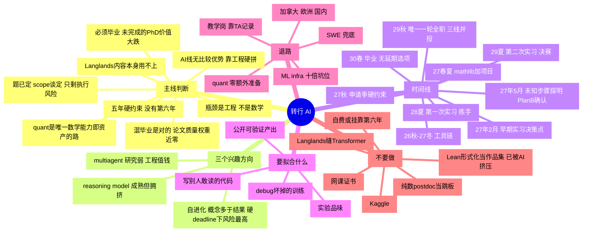

> [!abstract] 一句话
> 接下来 12 个月只需要做对两件事：**让论文问题变得可控**，以及**从不会写工程代码变成能提 PR**。其余都是次要的。现在要补一句：这两件事都没有第二次机会。

**基线**：2025-09 入学，funding 五年，**第六年没钱（2026-09-08 问过 DGS，已确认）**。2030 春毕业从"预计"变成**硬 deadline**。现在博二第一学期，方向 relative Langlands，**论文题已定、scope 与导师谈定**——主体路线清楚，中间有一两步技术性的东西还没证出来。

> [!danger] 没有第六年，到底改了什么
> 1. **延毕不再是缓冲，是财务事故。** 原方案里"relative Langlands 拖到六年很常见"是一块隐含的安全垫，这块垫子撤了。
> 2. ~~**论文选题从"重要"升到第一优先级。**~~ **同日关闭**：题已定、scope 已谈定，比死线早 20 个月。选择风险消除，剩下的是执行风险——见下一个 callout。
> 3. **"延一年再申一轮"这条退路被删掉了。** 这是求职失败后最常用的补救动作。2029 秋那一轮就是唯一一轮。
> 4. **2029 夏必须当转正来打。** 原来是"两次实习，第一次可以打差一点的"，现在实际是"一次练手 + 一次决赛"。
> 5. **探索型方向的成本上升。** 自进化那种"做一年发现在追一个测不准的东西"，以前是浪费，现在是致命。

> [!question] 定了题之后，风险变成了什么形状
> "混毕业应该不成问题"这个判断，**对一半**。
>
> **对的一半**：既然不走学术，minimal viable thesis 就是正确策略。论文的边际质量在 AI 求职市场里权重接近零——RE / MTS 面试不会问你的 Langlands 结果。唯一会看论文的是 AI for math postdoc 那条线，而那边真正看的是 formalization 实绩，不是这篇论文。所以"混"没有隐性成本，不用为这件事内耗。
>
> **不对的一半**：定题消除的是**选择风险**，不是**执行风险**。那"一两步未知"现在是唯一的方差来源，而它的难度分布是长尾的——大概率两个月，小概率两年，**在真正撞上去之前区分不了这两种**。而且现在的乐观是在还没开始推的时候做出的，这个时点的乐观是系统性的。
>
> **所以真正该锁的不是题，是失败模式。** scope 谈定了，意味着现在可以问导师一个非常具体的问题：
>
> > 如果这一两步到 2028 年夏天还没做出来，论文退到什么版本？
>
> 他能当场说出一个（assume 掉做 conditional 版本 / 退到 unconditional 的低秩与特例 / 数值与计算验证）= 毕业才真的锁死。说不出来 = 你定的是目标，不是题。**这是现在的第一优先级动作，成本是一次谈话。**

---

## 骨架图

---

## 一、方向判断

- **reasoning model**
    - 最成熟也最拥挤，RLVR 范式已定型
    - 真前沿：可验证域之外的 reward 设计、test-time compute 成本、RL 是教新能力还是 elicit 已有分布（至今无干净答案）
    - 有饭吃，但核心竞争是算力，外部单干难
- **AI 自进化**
    - 三样不同的东西被一个词包住，价值差别大
    - self-play / 自训练：争议大，收益常来自 verifier 而非"自我改进"，复现性差
    - automated curriculum：中等
    - 用 AI 自动化 AI 研究：真正的硬骨头，各家 lab 头号优先级，safety-sensitive
    - 风险：做一年发现在追一个测不准的东西。**五年制里这一年是 20% 的总预算**，原来能吃下，现在吃不下
- **multi-agent**
    - 研究：23–24 那批论文多数经不起 compute-matched baseline
    - 工程：编排、上下文管理、长程可靠性、错误恢复 —— 工业界最缺人的地方之一
    - 结论：**当论文选题一般，当技能栈很值钱**

> [!failure] AI for math / Lean 形式化：已排除（2026-09-08）
> 原判断是"这圈里多数人懂竞赛数学，不懂现代代数几何语言，所以我有比较优势"。**那句话描述的是机械转写上的稀缺性，而机械转写正是 2026 年被压掉的那一层。**
> 证据：2026-05 的 *Formalizing Mathematics at Scale* 里，AutoformBot 在 26 本教材上形式化了 4,007 条目标命题中的 **2,855 条（71.3%）**，产出 4.5 万条 Lean 4 declaration、约 50 万行代码，人类介入"从没有到每天发几条一般性建议"，并且**每行成本已低于专家人工**。
> 剩给人的是选题、审定义是否忠实、补 mathlib 缺的基础设施（Kahle 2026-04 把自己 2010 年那篇做到 sorry-free，最终代码近三分之一是 mathlib 没有的基建）。这些活是真的，但**更少、更资深**——正在收缩且资历门槛上移的口子，是 2029 年入场最差的一种。
> **连带删除**：AI for math 岗作为目的地、AI for math postdoc 那个例外、以及"mathlib PR 的第二个用途"这套论证。
> **代价要认**：Lean 是 AI 这条线里最后一个用到数学能力的东西。删掉之后 AI 线变成"纯数博士花三年学做 infra"——真实，但和 SWE 同池竞争，没有比较优势。**这直接把 quant 从并列选项推成主线**（见第三节）。

---

## 二、时间线

| 时段 | 数学 : AI | 关键产出 |
|---|---|---|
| 2026-09 → 2026-12 | 7 : 3 | 先撞那"一两步"把方差摸出来；工具链跑通、nanoGPT 从零、复现 2–3 篇 |
| 2027-01 → 2027-02 | 6 : 4 | **决策点**：投不投 startup 的 27 暑期实习（定题后倾向投） |
| 2027-03 → 2027-05 | 6 : 4 | **未知步骤难度探明 + Plan B 确认** |
| 2027-06 → 2027-08 | 6 : 4 | ML 系统 / kernel 的 merged PR + 一个独立项目，作品集定稿 |
| 2027-09 → 2027-12 | 6 : 4 | **申请季**，投 30–50 家 |
| 2028 夏 | — | 第一次实习（练手，可以打差的） |
| 2028-09 → 2029-05 | 5 : 5 | 论文主体必须成型，不是"推进" |
| 2029 夏 | — | **第二次实习 = 决赛**，目标转正 |
| 2029-09 → 2030-05 | 3 : 7 | 论文收尾 + **唯一一轮全职申请，三线并投** |

### 几个容易踩空的机制

- **暑期实习提前一年申请**。想要 2028 夏，2027 年 9 月就得投 → 作品集 deadline 是 **2027-08**，也就是 11 个月后
- **startup 招聘窗口在 2–4 月**，比大厂晚。这是 2027 年 2 月那个决策点的由来。命中的话整条路径提前一年 —— **在硬 deadline 下这条价值上升了**：等于把决赛从 2029 夏挪到 2028 夏，凭空多一次重试。定题之后又涨一档：原来要权衡"投实习会不会挤掉选题时间"，现在选题不占时间了，这个决策点从"要权衡"变成"应该投"
- **三个暑假，但只有两次半机会**。2027 夏（可选，靠 startup 窗口）、2028 夏（练手）、2029 夏（决赛）。没有 2030 夏。缓冲比原来估的薄一档
- ~~**论文问题的 18 个月惯性**~~ **已关闭**。题在博二第一学期就定了，比死线（2027-05）早 20 个月。惯性时钟从现在起算 → 2028 年春主体就该成型，比表里 2029-05 那个 checkpoint 还早一年。**这是整个计划里最大的一笔富余**
- **但惯性是双向的**（新增）。定得早，也意味着换得起的窗口更早关。如果那"一两步"到 2027 年 5 月还完全没进展，此时换题 = 时钟重置成 2027-05 + 18 个月 = 2028 年底才成型，只剩一年半，又回到延毕路径。所以 **2027-05 这个日期不是消失了，是换了含义**
- **比例可以往 AI 挪一档**（新增）。原来的 8:2 是为"选题还要大量探索"设计的；执行是可估时的，能压进固定时段，省下来的还给 AI。头一学期先到 7:3，等那"一两步"的难度摸清楚再走 6:4

---

## 三、要拟合什么

> [!warning] 核心问题
> 现在的训练分布和评估分布几乎不重叠。日常做的事（读 BZSV、抽象推导、单人作战）在目标 loss 里权重接近零。**要换数据，不是加数据。**

按权重排：

1. **能写别人敢读的代码** —— 陌生大型代码库里定位、修改、提 PR
2. **能 debug 一个悄悄坏掉的训练** —— loss 不降时的排查顺序。这条筛掉的人最多
3. **实验品味** —— 看到现象知道下一个跑什么、切掉哪个变量
4. **公开可验证的产出** —— 他们只信 commit history 和能跑的东西

前三条靠反复训练，第四条是前三条的证据。~~**mathlib 一次同时优化四项。**~~ **支点已更换为 ML 系统 / kernel**：vLLM / SGLang / PyTorch / Triton / TorchTitan 一类的真 PR。

选它的三个理由：**最对靶**（RE 面试的第三关就是训练推理系统设计）；**AI 最难代写的一层**（perf 工作要 profiling、硬件推理、数值精度，不是补全能糊出来的）；**产出形式和 mathlib 等价**（merged PR 就是 commit history）。
代价诚实说：**没有数学比较优势，和 SWE 同池竞争**。接受这一点，因为优势本来就在被竞争掉。

> [!tip] 作品集的规模按"够用"配，不按"最大"配
> quant 面试是闭卷的（概率 / 心算 / coding），**根本不看公开产出**。所以整个作品集只服务于第二梯队。够过 RE 那一关就停，不要滑向"建立研究身份"——那是 Research Scientist 的目标，已经明确放弃。

### 岗位梯队（按难度排，2026-09-08 重排）

> [!important] 先分清两种"难"
> 只有一轮申请，所以问题不是"哪个最难"，是**哪种难度能在最后 6–12 个月靠突击补上**。
> **可攻的难**：筛选考存量能力 + 刷题，命中率随投入上升 → quant。
> **不可攻的难**：筛选考三年前就该开始的积累（top-tier 一作、连贯研究故事）→ frontier lab RS，2029 年补不上。
> 同样是"最难进"，一个值得冲，一个是净损失。

- **第一梯队 · 主线** —— 顶级自营 / HFT 的 **Quant Researcher**（Jane Street / HRT / Citadel Securities / Jump / XTX / Optiver / SIG）
    - 难度：Citadel 实习 108,000 份申请收不到 300 人，约 **0.4%**，比 frontier lab RE 更难进
    - 薪资：entry QR 总包 **$350K–$1M+**；Jane Street QR 报 $356K–$450K+，Citadel $386K–$594K+；第五年"存活者中位数" $800K–$1.2M。**高于 frontier lab RE**
    - 为什么是主线：**"内容不重要"把 quant 唯一的劝退因素消掉了**，而它吃的是存量能力（概率 / 组合 / 心算），**不占主线时间**，可压到 2029 上半年突击
    - 真代价：可迁移性差；sign-on 不重复，第二年没做出 PnL 会掉
    - 同梯队：顶级 HFT 的 core dev / 低延迟（Jane Street OCaml、HRT core、IMC），难度薪资接近，吃真工程功底
- **第二梯队 · 并投** —— **Research Engineer / MTS**（Anthropic / OpenAI / GDM / xAI）
    - entry 总包 **$420K–$700K**（base $220–300K + equity $200–400K/年），mid $580K–$1.1M，"PhD typical but not required"
    - 难度高但**类型对**：代码筛 → DL 原理深挖 → 训练推理系统设计 → 拿项目往死里问，正是 2026–2029 要建的东西
    - equity 是 pre-IPO 非流动的，纸面数字打折看
- **第三梯队 · 兜底** —— Applied ML / ML Infra：headcount 最大，最像 SWE
- **明确放弃** —— **Research Scientist**：不是因为难，是因为难的类型不可攻。有估计称全球"合格资深研究员"池子只有 1,000–3,000 人，2030 年不在里面

### 明确不做

- [ ] ~~网课和证书~~ 零权重
- [ ] ~~Kaggle~~
- [ ] ~~外部单干 crowded 方向的 NeurIPS 一作~~ 在跟算力多两个数量级的团队抢同一个坑
- [ ] ~~每天刷 arXiv 当学习~~ 会写代码之前边际收益很低
- [ ] ~~"Langlands + Transformer" 缝合项目~~ 两个社区都不认
- [ ] ~~Lean / mathlib 当作品集~~ 2026-09-08 排除，理由见第一节

---

## 四、欧洲 / postdoc 路线

### 纯数 postdoc 当跳板：性价比更差了

- 不解决核心短板，反而锁死 2–3 年继续做无关的事
- 叙事变差：直接转 = 转行者；postdoc 后转 = 学术失败者
- **新增**：五年制下 postdoc 申请季（2029 秋）和唯一一轮全职申请季完全重叠。原来还能"博四投工业、博五投 postdoc"错开，现在只能二选一，或者两边都做成半吊子
- **唯一合理版本**：保底而非计划。2029 秋主投工业，低成本顺手投几个

### ~~例外：AI for math 方向的 postdoc~~ 已删除（2026-09-08）

原来这是唯一一个划算的 postdoc 版本，理由是"mathlib PR 同一动作打开两条路"。形式化被 AI 挤压之后这条论证整个失效：岗位本来就少，入场资历门槛还在上移。
**结论因此简化了**：postdoc 这一栏现在没有例外，全部不划算。少一个选项，也少一根博四博五焦虑时会去抓的稻草。

### 欧洲市场结构

- **签证是真优势**：Blue Card / Chancenkarte / 荷兰 highly skilled / 法国 Passeport Talent，不用抽签
- **市场小**：伦敦（中心，但脱欧后独立体系，Global Talent visa 对博士友好）、巴黎、苏黎世（薪资最高）、阿姆斯特丹/柏林/慕尼黑（偏应用）
- **薪资通常是美国一半左右**，苏黎世例外。这是主要代价，不是签证
- 欧洲 RS 岗更看重发表（很多组学术传统出身），工程岗则与美国类似

---

## 五、退路（按失败程度分层）

> [!note] 先定义失败
> 真失败 = 2030 毕业时既无 offer 也无作品集。
> 拿到二线公司 ML/agent 工程岗 = **median outcome，不是失败**。误判这一点会导致糟糕的补救决策。

> [!warning] 这一节缩水了（2026-09-08）
> **quant 已从"第一层退路"提升为主线**（见第三节梯队），不在这里计数。退路里最强的一个没了——因为它变成了正门。

- **第一层 · 仍在 AI 附近**
    - ML infra / 平台：headcount 十倍于研究岗，**现在也是主线作品集那批 PR 的直接对口**，可内部转研究
    - AI for science：竞争比 LLM 方向小一个量级
    - national labs / IDA-CCR：通常需公民身份
- **第二层 · 换地理**
    - 加拿大：GTS 两周下签，永居路径远优于美国；多伦多、蒙特利尔
    - 国内：DeepSeek / 月之暗面 / 智谱 / 千问 / 字节 Seed，对数学博士接受度高。**成功概率显著高于美国路线**（原来这里还写了"AI for math 投入不小"，该论据随形式化一起删除）
    - 国内 / 香港的量化：与第一梯队同一套准备，边际成本接近零
    - 新加坡、以色列、日本
- **第三层 · 留在数学换赛道**
    - 教学岗（SLAC / community college）：竞争远小于研究型 TT，**依赖 TA 记录，所以现在别敷衍 TA**
    - 顶尖高中 / 竞赛教育 / 国际学校
- **第四层 · 兜底**
    - SWE：ML 系统那批 PR 做扎实后你就是"能写代码的人"，市场大两个数量级

> [!tip] 关键结构（已修正）
> 几乎所有退路都被同一批动作覆盖：**工程能力 + 公开产出 + 不搞砸教学和人际关系**。不需要为失败单独准备。
> 但**执行方式要改**：原来可以串行试（美国不行再试国内），没有第六年之后必须**并投**——2029 秋第一天就三线同时发，因为没有"看完一轮反馈再补投"的时间预算。

---

## 六、止损点

- **2027 年 5 月**（含义已更新，仍是最重要的一个）：~~论文问题仍未锁定~~ → **那"一两步"的难度仍未探明，或者 Plan B 还没和导师确认**。触发的动作是一次摊牌式谈话，不是换题（换题的代价见上面"惯性是双向的"）。这个点决定的仍然是**有没有博士学位**，比后面两个决定"去哪工作"的点重要一个量级
- **2028 年底**：实习完全没拿到 → 作品集不够硬，还有一年半补救。加大 quant + infra 投入，降低研究岗预期
- **2029 年 8 月**（又提前一个月）：quant 招聘 8 月就开，"等校园招聘会已经是结构性劣势"。原来写 9 月，那个日期对 AI 岗合适，**对现在的第一梯队已经晚了**。美国 AI 岗 / quant / 加拿大 + 国内，第一天就并投

> [!danger] 真正该防的
> 不是"进不了 frontier lab"，是**在博四博五因焦虑做出锁死自己的决定**（二次 PhD、纯数 postdoc）。
> 没有第六年之后多一条：**为了多争取时间去自费或挂靠留第六年**。那是用真金白银买一个本该在 2027 年靠选题解决的问题——真到那一步，说明 2027 年 5 月那个止损点已经失守了。

---

## 七、变量状态

> [!success] 已确认（2026-09-08，一天关掉两个）
> **1. 第六年没有 funding。** 五年就是五年。真要留第六年只能靠系外 TA / 自费 / 挂靠，成本极高——规划时当它不存在。顺带值一封邮件的成本：系里有没有 dissertation completion fellowship 之类的东西，不指望，但问一句是免费的。
> **2. 论文题已定，scope 与导师谈定。** 原本排第一的未确认变量，比死线早 20 个月关闭。

剩下的按新优先级排：

- [ ] **Plan B 的论文长什么样**（接替上一条，成为新的第一位）—— 不是问"能不能证出来"，是问"证不出来的时候还有没有论文"。原句：**"如果这一两步到 2028 年夏天还没做出来，我们退到什么版本？"** 常见答案：assume 掉做 conditional 版本、退到 unconditional 的低秩或特例、数值与计算验证。他能当场给一个 = 毕业锁死；给不出 = 现在定的是目标不是题。**成本一次谈话，收益是整个计划里最大的一块确定性**
- [ ] **TA 负担有多重** —— 每周 8–10 小时 AI 时间若是"剩下的时间"，实际会是零。必须固定时段、写进日历、优先级高于回邮件
- [ ] **护照 / 签证** —— 若国际学生：CPT 提前一学期问 OIS；很多 startup 不 sponsor H-1B，选公司时要预筛；O-1 材料从现在攒（审稿留记录）；STEM OPT 三年从 2030 春起算，别浪费。**毕业时间固定之后，整条签证时间线也跟着固定了，可以现在就往后倒排**

---

## 八、近三个月 TODO

- [x] ~~问 DGS 第六年 funding~~ → 已问，答案是**没有**
- [x] ~~和导师谈论文问题范围，争取"有终点线"的题~~ → 题已定，scope 谈定
- [ ] **和导师确认 Plan B**："这一两步到 2028 夏还没做出来的话，退到什么版本？"——当前第一优先级
- [ ] 头一个学期先撞那"一两步"，目的是**估难度**，不是证出来。估出来了才知道 7:3 能不能提到 6:4
- [ ] 顺手问系里有没有 dissertation completion fellowship / 系外 TA line
- [ ] 在日历上把 **2027-05（未知步骤探明 + Plan B 确认）** 和 **2027-08（作品集定稿）** 标成硬事件，不是软目标
- [ ] 申请 JHU 集群账号，另备几百刀租卡预算
- [ ] 从零写 GPT 并训起来，每行能解释
- [ ] 复现 2–3 篇论文（是复现，不是读）
- [ ] 基建：git 工作流 / docker / wandb / 集群调度 / pytest / profiler
- [ ] 固定每周 AI 时段进日历，按 7:3 排（比原计划的 8:2 多一档，因为选题不再吃探索时间）
- [ ] ~~装 Lean 4，跑通 mathlib 本地编译~~ → 2026-09-08 排除
- [ ] 选定 ML 系统的落脚点（vLLM / SGLang / PyTorch / Triton 挑一个），把 build 跑通、通读 issue 列表，找到第一个能下手的口子
- [ ] quant 的准备**明确排到 2029 上半年**，现在一分钟都不投——它的价值恰恰在于不占主线时间

---

## 相关笔记

- [[23 AI for Mathematics]] —— 保留作为知识，已不再是路线的一部分（2026-09-08 排除）
- [[13 系统与工程]] —— "debug 一个悄悄坏掉的训练"要补的东西，**现在也是作品集的主战场**
- [[22 RLHF 与推理 RL]] —— reasoning model 方向的背景
- [[09 Scaling laws]] —— 判断哪些方向的"前沿"是算力问题
- [[Running Logs]] —— 论文那边的实际进度

待建：[[Langlands 论文问题候选]]、[[mathlib PR 记录]]、[[实习申请追踪]]、[[复现论文清单]]
