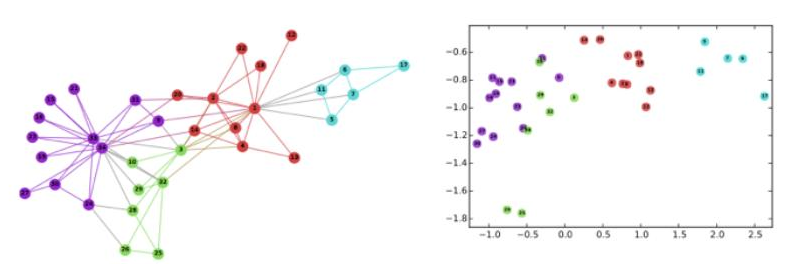
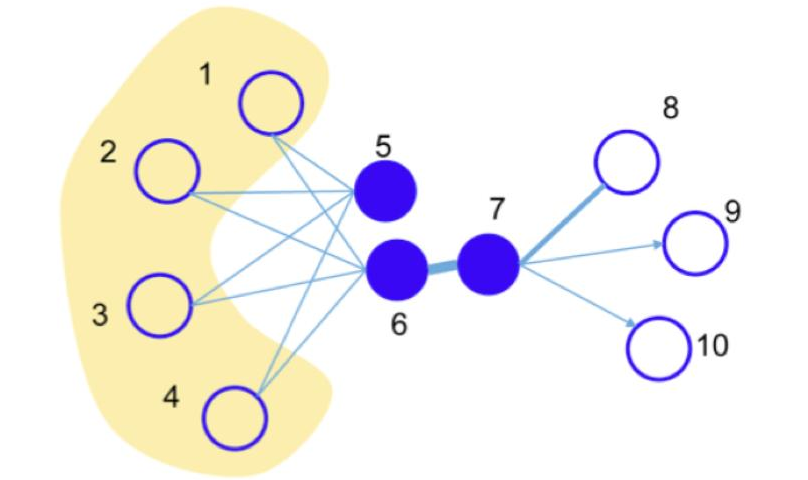
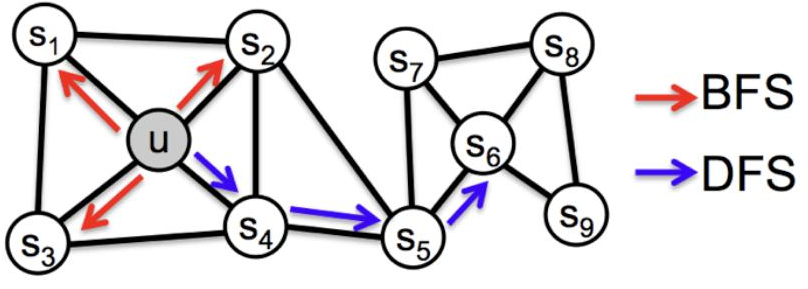
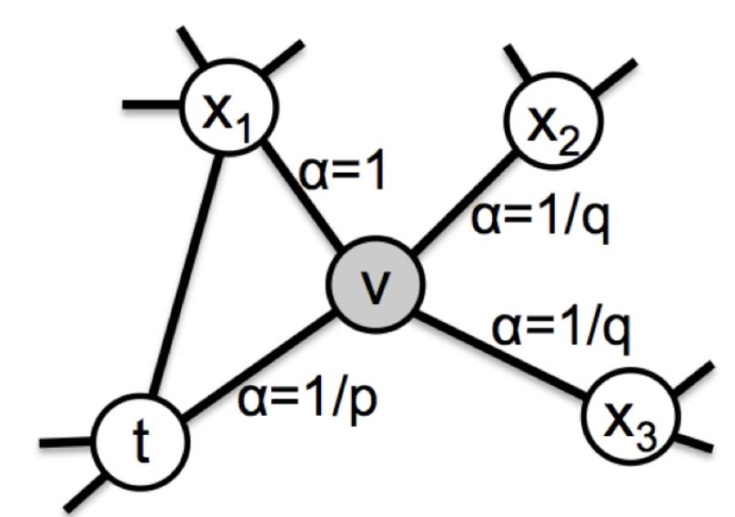
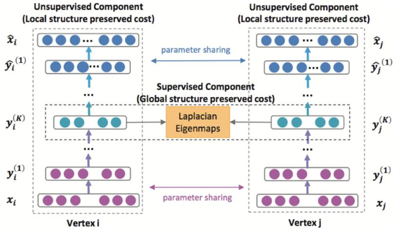

# 24 图上的学习

> [[10 归纳偏置与等变性#43-图神经网络与置换等变|10 §4.3]] 回答的是"**哪些**层是 $S_n$-等变的"：答案是一个维数等于 Bell 数 $B(2k)$、与节点数 $n$ 无关的线性空间，配上 1-WL 的表达力上界。那是一个分类定理，干净但抽象。
>
> 这一篇回答互补的问题：**人们实际在用哪几个层，它们是怎么被推导出来的，以及在节点根本没有特征向量的时候该怎么办。**第 2–3 节是前者（谱与空间两条路线），第 4 节是后者（图嵌入）。第 5 节说明这两条线在 2017 年之后为什么合流了。
>
> 前置：图拉普拉斯的谱理论、Chebyshev 多项式、[[12 Transformer#24-图上的消息传递|12 §2.4]]（attention 就是完全图上的消息传递）。

> [!question] 卡住了从哪儿看起
> - [Hamilton, *Graph Representation Learning Book*](https://www.cs.mcgill.ca/~wlh/grl_book/) — 这个领域的标准教材，免费，**第 1–5 章正是本篇的展开版**
> - [Distill, *A Gentle Introduction to Graph Neural Networks*](https://distill.pub/2021/gnn-intro/) — 交互式图解，建立直觉最快
> - [Kipf 的博客 *Graph Convolutional Networks*](https://tkipf.github.io/graph-convolutional-networks/) — GCN 作者自己讲动机，比论文好读
> - [Bronstein et al., *Geometric Deep Learning*](https://arxiv.org/abs/2104.13478) §5.3 — 把本篇放回 [[10 归纳偏置与等变性#5-geometric-deep-learning-的统一框架|"5G" 框架]]

## 1. 设定：两个问题

图 $G=(V,E)$，$|V|=n$，邻接矩阵 $A\in\R^{n\times n}$，度矩阵 $D=\mathrm{diag}(A\mathbf 1)$。目标永远是给每个节点一个向量 $z_v\in\R^d$（图级或子图级表示由节点表示汇聚而来，如取平均）。

区别在于**输入里有没有节点特征**：

| | 有特征 $X\in\R^{n\times d_0}$ | 无特征（只有 $A$） |
|---|---|---|
| 学什么 | 一个**函数** $f_\theta(X,A)$ | 一张**查找表** $\Phi\in\R^{n\times d}$ |
| 新节点 | 直接前向算 → **归纳式（inductive）** | 必须重训 → **直推式（transductive）** |
| 代表 | GCN、GraphSAGE、GAT（第 2–3 节） | DeepWalk、LINE、node2vec、SDNE（第 4 节） |

历史上第二类先出现（2014–2016，脱胎于 word2vec），第一类随后（2016–2018，脱胎于谱图论）。**它们最后被证明是同一件事的两个面**，见第 5 节。

> [!note] 为什么"图上的卷积"不平凡
> $\Z^d$ 上的卷积之所以存在，是因为 $\Z^d$ 是一个群，卷积就是与群作用交换的算子（[[10 归纳偏置与等变性#2-卷积的刻画定理|10 §2]] 的刻画定理）。一般的图**没有群结构**：节点之间没有"往右移一格"这种可迁移的对应关系，邻居也没有典范排序。
>
> 于是只剩两条路：**要么在 Fourier 域定义卷积**（谱方法，第 2 节——图拉普拉斯的特征分解替代了 Fourier 变换），**要么放弃卷积、直接定义局部聚合**（空间方法，第 3 节——只要求聚合对邻居的排列不变）。

## 2. 谱方法：图拉普拉斯

### 2.1 图 Fourier 变换

**非归一化拉普拉斯** $L=D-A$；**对称归一化拉普拉斯**
$$\mathcal L=D^{-1/2}LD^{-1/2}=I-D^{-1/2}AD^{-1/2}.$$

**基本事实.** $\mathcal L$ 半正定，谱 $\subset[0,2]$；$0$ 是特征值，重数等于连通分支数；二次型是 Dirichlet 能量
$$x^\top L x=\tfrac12\sum_{(u,v)\in E}(x_u-x_v)^2 .$$

设 $\mathcal L=U\Lambda U^\top$。类比 $\R^d$ 上 $-\Delta$ 的特征函数是平面波，**定义**图 Fourier 变换 $\hat x=U^\top x$，特征值 $\lambda_i$ 扮演"频率平方"的角色（$\lambda$ 大 ⟺ 该特征向量在边上振荡剧烈，由上面的 Dirichlet 能量看出）。

**谱卷积**（[Bruna et al. 2014](https://arxiv.org/abs/1312.6203)）就定义为在 Fourier 域上逐点相乘：
$$g_\theta\star x=U\,g_\theta(\Lambda)\,U^\top x .$$

这个定义是正确的但**不可用**，三个理由缺一不可致命：

1. 特征分解要 $O(n^3)$，每次前向要 $O(n^2)$；
2. 参数个数 $O(n)$，随图的大小增长；
3. $g_\theta(\Lambda)$ 一般是**全局**算子——$U g_\theta(\Lambda)U^\top$ 没有稀疏性，"卷积核的局部支撑"这个 CNN 的核心性质丢失了；
4. 学到的 $\theta$ 绑死在这张图的谱上，**换一张图就没有意义**。

### 2.2 ChebNet：多项式滤波

[Defferrard–Bresson–Vandergheynst (2016)](https://arxiv.org/abs/1606.09375) 的修正：把 $g_\theta$ 限制成 $\mathcal L$ 的 $K$ 次多项式。

**引理（多项式即局部）.** 若 $p$ 是 $K$ 次多项式，则 $(p(\mathcal L))_{uv}=0$ 只要 $d_G(u,v)>K$。

*证明.* $(\mathcal L^k)_{uv}\ne0$ 蕴含存在长度 $\le k$ 的 $u\to v$ 途径。$\square$

**这一行同时解决了上面四个问题**：$K$ 次多项式滤波器自动是 $K$-局部的，参数只有 $K+1$ 个，且是 $\mathcal L$ 的函数因而与图无关（可迁移），最后——用 Chebyshev 递推
$$T_0=I,\quad T_1=\tilde{\mathcal L},\quad T_k(\tilde{\mathcal L})=2\tilde{\mathcal L}T_{k-1}(\tilde{\mathcal L})-T_{k-2}(\tilde{\mathcal L}),\qquad \tilde{\mathcal L}=\tfrac{2}{\lambda_{\max}}\mathcal L-I,$$
可以在 $O(K|E|)$ 内算出 $\sum_{k=0}^K\theta_kT_k(\tilde{\mathcal L})x$ 而**完全不做特征分解**。用 Chebyshev 而非幂基不是随意的：$\{T_k\}$ 在 $[-1,1]$ 上关于 $(1-t^2)^{-1/2}$ 正交，数值上远比 $\{\tilde{\mathcal L}^k\}$ 稳定。

### 2.3 GCN：$K=1$ 的极简版

[Kipf–Welling (2017)](https://arxiv.org/abs/1609.02907) 取 $K=1$ 并近似 $\lambda_{\max}\approx2$：
$$g_\theta\star x\approx\theta_0x+\theta_1(\mathcal L-I)x=\theta_0x-\theta_1D^{-1/2}AD^{-1/2}x .$$
再令 $\theta:=\theta_0=-\theta_1$（减参数、抗过拟合）：
$$g_\theta\star x\approx\theta\big(I+D^{-1/2}AD^{-1/2}\big)x .$$
$I+D^{-1/2}AD^{-1/2}$ 的谱在 $[0,2]$，反复作用会数值爆炸。**重整化技巧（renormalization trick）**：令 $\tilde A=A+I$、$\tilde D=\mathrm{diag}(\tilde A\mathbf 1)$，用
$$I+D^{-1/2}AD^{-1/2}\ \longrightarrow\ \tilde D^{-1/2}\tilde A\tilde D^{-1/2}=:\hat A .$$
得到**GCN 层**：
$$\boxed{\;H^{(l+1)}=\sigma\!\big(\hat AH^{(l)}W^{(l)}\big),\qquad H^{(0)}=X.\;}$$

两个细节值得单独说，因为它们经常被当成"工程技巧"，其实各有内容：

- **加自环 $A+I$** 不是可有可无的：没有它，节点更新时不包含自己的表示，$\hat A$ 在二部图上会有 $-1$ 的特征值，深层网络产生振荡。
- **对称归一化 $\tilde D^{-1/2}\tilde A\tilde D^{-1/2}$ 而非 $\tilde D^{-1}\tilde A$**：后者是随机矩阵（行和为 1，即邻居取平均），前者保持对称因而谱是实的，且给高度节点的贡献降权 $d_u^{-1/2}d_v^{-1/2}$ 而非 $d_u^{-1}$。

> [!tip] GCN 是图上的热流
> $\hat A\approx I-\mathcal L$（差一个自环修正），所以一层 GCN 的传播部分是 $e^{-\mathcal L}$ 的一阶近似，$l$ 层就是 $(I-\mathcal L)^l$——**图上的热半群离散化**。这个观察不是修辞，它直接给出下一小节的定理。

### 2.4 过平滑：一个定理，不是一个经验现象

热流的问题是它**收敛到常数**。

**定理（过平滑，[Oono–Suzuki 2020](https://arxiv.org/abs/1905.10947) 的简化陈述）.** 设 $\mathcal M$ 是 $\hat A$ 的最大特征值对应的不变子空间（对连通非二部图，由 $\tilde D^{1/2}\mathbf 1$ 张成），$\lambda$ 是次大特征值的模。若各层权重满足 $s:=\sup_l\|W^{(l)}\|_2$，则
$$d_{\mathcal M}\big(H^{(l)}\big)\le(s\lambda)^l\,d_{\mathcal M}\big(H^{(0)}\big),$$
其中 $d_{\mathcal M}$ 是到 $\mathcal M$ 的距离。于是 $s\lambda<1$ 时**所有节点表示指数快地退化到同一个方向**，节点间的区分信息完全丢失。

（$\mathrm{ReLU}$ 是 $\mathcal M$ 上的非扩张投影，这是证明能穿过非线性的原因。）

**推论**：GCN 深度不能大。实践中 2–3 层最优，这与 CNN 的"越深越好"形成尖锐对比，**是图上做深度学习的核心困难**。缓解手段——残差/跳连、PairNorm、DropEdge、把 $\hat A^K$ 一次性算出来（SGC）——都是在对抗这个定理。

一个等价的能量表述（[Cai–Wang 2020](https://arxiv.org/abs/2006.13318)）：Dirichlet 能量 $\mathcal E(H)=\mathrm{tr}(H^\top\mathcal LH)$ 沿层指数衰减。**过平滑就是热方程做了它该做的事。**

## 3. 空间方法：消息传递

放弃 Fourier，直接写局部更新。[Gilmer et al. (2017)](https://arxiv.org/abs/1704.01212) 的 **MPNN** 框架把这一族全部收编：
$$m_v^{(l+1)}=\bigoplus_{u\in\mathcal N(v)}M_l\big(h_v^{(l)},h_u^{(l)},e_{uv}\big),\qquad h_v^{(l+1)}=U_l\big(h_v^{(l)},m_v^{(l+1)}\big),$$
其中 $\bigoplus$ 是**排列不变**的聚合（sum / mean / max）——这一条就是全部的归纳偏置，也正是 [[10 归纳偏置与等变性#43-图神经网络与置换等变|10 §4.3]] 里 $S_n$-等变性的来源。

### 3.1 GraphSAGE：采样 + 聚合，转向归纳式

[Hamilton–Ying–Leskovec (2017)](https://arxiv.org/abs/1706.02216)。核心不是聚合器的选择，而是**学一个函数而不是一张表**：

$$h_{\mathcal N(v)}^{k}=\mathrm{AGGREGATE}_k\big(\{h_u^{k-1}:u\in\mathcal N(v)\}\big),\qquad
h_v^{k}=\sigma\!\Big(W^k\cdot\mathrm{CONCAT}\big(h_v^{k-1},\,h_{\mathcal N(v)}^{k}\big)\Big),$$
每层末尾做 $h_v^k\leftarrow h_v^k/\|h_v^k\|_2$。

- **CONCAT 而非求和**：自己的表示与邻居的表示各走各的权重，这比 GCN 把两者混在一个 $\hat A$ 里表达力更强。
- **邻居采样**：每层对每个节点**等概率抽取固定个数**的邻居（不足则有放回），且每层独立重抽。于是单个节点的计算量是 $O(\prod_k S_k)$ 而与图的度分布无关——这是能在千万级图上跑的原因，代价是引入了方差。
- **minibatch 要反向准备**：先自外向内算出 $\mathcal B^{K}\subset\mathcal B^{K-1}\subset\cdots\subset\mathcal B^0$（$\mathcal B^{k-1}=\mathcal B^k\cup\mathcal N_k(\mathcal B^k)$），再自内向外做 $K$ 轮聚合。
- **无监督损失**（想学通用表示时）：
  $$J(z_u)=-\log\sigma(z_u^\top z_v)-Q\,\mathbb{E}_{v_n\sim P_n}\log\sigma(-z_u^\top z_{v_n}),$$
  $v$ 是从 $u$ 出发定长随机游走可达的节点，$P_n$ 是负采样分布。**这个损失和第 4 节的图嵌入是同一个**——区别只在于 $z$ 现在是算出来的而不是查表得到的。
- 聚合器：mean、LSTM（把邻居随机排成序列，刻意破坏 LSTM 的有序性假设）、pooling
  $$\mathrm{AGGREGATE}^{\text{pool}}=\max\big\{\sigma(W_{\text{pool}}h_u+b):u\in\mathcal N(v)\big\}.$$
  原文报告 pooling 与 LSTM 最好。

### 3.2 GAT：用 attention 定权

[Veličković et al. (2018)](https://arxiv.org/abs/1710.10903)。GCN 的边权由度决定（$d_u^{-1/2}d_v^{-1/2}$，纯结构），GAT 让它由**内容**决定：
$$e_{ij}=\mathrm{LeakyReLU}\big(\vec a^\top[Wh_i\,\|\,Wh_j]\big),\qquad
\alpha_{ij}=\frac{\exp(e_{ij})}{\sum_{k\in\mathcal N_i}\exp(e_{ik})},$$
$$h_i'=\sigma\Big(\sum_{j\in\mathcal N_i}\alpha_{ij}Wh_j\Big),$$
中间层用多头拼接 $h_i'=\big\|_{k=1}^{K}\sigma(\sum_j\alpha_{ij}^kW^kh_j)$，最后一层改为求平均再过非线性。

优点是计算可对每条边并行、天然处理不同度数的节点、且是纯局部的（不需要全图结构，因而归纳式）。

> **GAT 与 Transformer 是同一个层。**把图取成完全图、把 $e_{ij}$ 的加性打分换成缩放点积，GAT 就是 self-attention；反过来，[[12 Transformer#24-图上的消息传递|Transformer 就是完全图上的 GAT]]，位置编码是加在节点上的特征。这不是类比，是定义上的重合。

### 3.3 其他两个值得知道的变体

**R-GCN**（关系型，[Schlichtkrull et al. 2018](https://arxiv.org/abs/1703.06103)）——边有类型时，每类边一套参数：
$$h_v^{t}=\rho\Big(\sum_{r\in\mathcal R}\frac{1}{|\mathcal N_v^r|}\sum_{u\in\mathcal N_v^r}W_r h_u^{t-1}+W_0h_v^{t-1}\Big).$$
参数量随关系数线性增长，故实践中对 $\{W_r\}$ 做基分解或块对角约束。知识图谱的标准做法。

**GGNN**（[Li et al. 2016](https://arxiv.org/abs/1511.05493)）——把"层"换成"时间步"，用 GRU 做更新、跨步共享参数：
$$a_v^t=A_v^\top[h_1^{t-1}\cdots h_N^{t-1}]^\top+b,\qquad h_v^t=\mathrm{GRU}(h_v^{t-1},a_v^t).$$
门控在这里的作用正是**对抗 §2.4 的过平滑**：GRU 的更新门允许节点选择性地保留自己的旧表示。

### 3.4 表达力：回到 1-WL

所有 MPNN 的区分能力 $\le$ 1-Weisfeiler–Leman（[[10 归纳偏置与等变性#43-图神经网络与置换等变|10 §4.3]]）。上界什么时候取到？

**定理（[Xu et al. 2019](https://arxiv.org/abs/1810.00826)）.** 若聚合 $\bigoplus$ 与更新 $U$ 都是**多重集上的单射**，则 MPNN 与 1-WL 等强。mean 与 max 不是单射（$\{a,b\}$ 与 $\{a,a,b,b\}$ 的均值相同），**sum 是**。

于是 **GIN**：$h_v^{(l+1)}=\mathrm{MLP}\big((1+\epsilon)h_v^{(l)}+\sum_{u\in\mathcal N(v)}h_u^{(l)}\big)$，是这一族里唯一达到上界的。

**代价**：GCN/GraphSAGE(mean) 的平滑正是它们在同质图（homophilous）上泛化好的原因。**表达力与归纳偏置在这里是直接冲突的**——这是 [[08 泛化之谜]] 那套议题在图上的具体形态。

## 4. 图嵌入：没有节点特征的时候

若输入只有 $A$，就没有函数可学，只能学 $\Phi:V\to\R^d$ 这张表。目标一律是：**共享的（高阶）邻居越多，向量越近。**

### 4.1 DeepWalk：把图当语料

[Perozzi–Al-Rfou–Skiena (2014)](https://arxiv.org/abs/1403.6652)。从每个节点出发做 $\gamma$ 次长为 $t$ 的随机游走，**把得到的节点序列当成句子**，直接套 word2vec 的 skip-gram：
$$\min_\Phi\ -\log\Pr\big(\{v_{i-w},\dots,v_{i+w}\}\setminus v_i\ \big|\ \Phi(v_i)\big),$$
用 Hierarchical Softmax（沿 $V$ 上的一棵二叉树）或负采样把 $|V|$ 项的归一化降到 $O(\log|V|)$。

随机游走捕获的是节点的**局部上下文**；等长游走保证了后续训练的批处理规整。

### 4.2 LINE：把一阶与二阶邻近显式写出来

[Tang et al. (2015)](https://arxiv.org/abs/1503.03578)。DeepWalk 的邻近关系隐含在游走里，LINE 把它拆成两个可分别优化的目标。

**一阶**（仅无向图）：
$$p_1(v_i,v_j)=\frac{1}{1+\exp(-u_i^\top u_j)},\qquad \hat p_1(i,j)=\frac{w_{ij}}{W},\qquad O_1=d\big(\hat p_1,\,p_1\big),$$
**二阶**（有向、带权均可）：每个节点有两个向量——作为节点本身的 $u_i$ 与作为"上下文"的 $u_i'$：
$$p_2(v_j\mid v_i)=\frac{\exp(u_j'^\top u_i)}{\sum_{k}\exp(u_k'^\top u_i)},\qquad O_2=\sum_i\lambda_i\,d\big(\hat p_2(\cdot\mid v_i),\,p_2(\cdot\mid v_i)\big),$$
$d$ 取 KL 散度，$\lambda_i$ 一般取节点的度。最终表示是两个目标各自学出的向量的拼接。

> 训练上有一个真实的坑：带权图上梯度的尺度与 $w_{ij}$ 成正比，权重跨几个数量级时梯度爆炸。LINE 的解法是**按权重做边采样**再当作无权图训练——把权重从梯度里挪到采样分布里。这个技巧后来到处都是。

### 4.3 node2vec：把"局部 vs 全局"变成两个超参

[Grover–Leskovec (2016)](https://arxiv.org/abs/1607.00653)。观察：随机游走可以偏向 BFS（刻画**结构角色**：桥、中心、叶）或偏向 DFS（刻画**社群归属**）。

于是用**二阶**随机游走：从 $t$ 走到 $v$ 后，下一步转移到 $x$ 的未归一化概率为 $\pi_{vx}=\alpha_{pq}(t,x)\cdot w_{vx}$，
$$\alpha_{pq}(t,x)=\begin{cases}1/p,& d_{tx}=0\quad(\text{走回 }t)\\ 1,& d_{tx}=1\quad(x\text{ 与 }t\text{ 相邻})\\ 1/q,& d_{tx}=2\quad(\text{走远})\end{cases}$$

$q>1$ 偏 BFS（局部），$q<1$ 偏 DFS（外扩），$p$ 大则不易回头。$p=q=1$ 退化为 DeepWalk。**DeepWalk 是 node2vec 的一个点，而 node2vec 是一条二维曲面**——这就是这篇论文的全部内容，简单但有效。

### 4.4 SDNE：一阶 + 二阶，但用自编码器

[Wang–Cui–Zhu (2016)](https://www.kdd.org/kdd2016/papers/files/rfp0191-wangAemb.pdf)。前三种都是浅层模型（本质是矩阵分解，见 §4.5）。SDNE 换成深度自编码器：

- **无监督部分（二阶）**：自编码器重构节点的邻接行 $x_i=A_{i,:}$。因为 $A$ 极稀疏，直接重构会退化成全零，故加惩罚权重 $b_i$（有边处权重 $>1$）：
  $$\mathcal L_{2nd}=\sum_{i=1}^{n}\big\|(\hat x_i-x_i)\odot b_i\big\|_2^2=\big\|(\hat X-X)\odot B\big\|_F^2 .$$
  重构邻接行就是"两个节点的邻居集合相似 ⟹ 表示相似"，正是二阶邻近。
- **监督部分（一阶）**：对瓶颈层表示 $y_i=y_i^{(K)}$ 加
  $$\mathcal L_{1st}=\sum_{i,j}s_{ij}\|y_i-y_j\|_2^2=2\,\mathrm{tr}(Y^\top LY),$$
  **这就是 Laplacian Eigenmaps 的目标**——相连的节点表示要近。
- 合起来 $\mathcal L=\mathcal L_{2nd}+\alpha\mathcal L_{1st}+\nu\mathcal L_{reg}$。

> [!note] 一个对数学家有意思的读法
> $\mathcal L_{1st}=2\,\mathrm{tr}(Y^\top LY)$ 在正交约束下的最小值由 $L$ 的最小几个非零特征向量给出——**即谱聚类**。SDNE 只是把这个经典变分问题的解空间从"线性子空间"换成了"自编码器的像"，并加了一个重构项作正则。
>
> 沿这条线看，第 4 节的四种方法都是在给同一个"图上的低维嵌入"问题挑不同的假设类，而 §4.5 会说明前三种其实连假设类都一样。

### 4.5 统一：它们都是矩阵分解

这是给数学家的关键一句，也是这一整节唯一必须记住的定理。

**定理（[Levy–Goldberg 2014](https://papers.nips.cc/paper/5477-neural-word-embedding-as-implicit-matrix-factorization)）.** 带负采样的 skip-gram（SGNS）在维数充分大时的最优解满足
$$u_w^\top c_v=\mathrm{PMI}(w,v)-\log k,$$
即它隐式地分解了**平移的逐点互信息矩阵**。

**定理（[Qiu et al. 2018, NetMF](https://arxiv.org/abs/1710.02971)）.** 把上式中的"共现"换成随机游走的共现，得到：DeepWalk 隐式分解
$$\log\left(\frac{\mathrm{vol}(G)}{bT}\sum_{r=1}^{T}\big(D^{-1}A\big)^{r}D^{-1}\right)-\log b,$$
LINE 是其 $T=1$ 的特例；node2vec 与 PTE 有相应的（二阶游走 / 异构）版本。

**推论.** DeepWalk / LINE / node2vec 之间的差别，全部是"分解哪一个由 $D^{-1}A$ 的多项式给出的矩阵"的差别。它们与谱嵌入的距离，比这个领域的命名法暗示的要近得多。

## 5. 两条线为什么合流

第 4 节的方法有三个硬伤，恰好是第 3 节解决的：

1. **不能处理新节点**（直推式），因为学的是查找表；
2. **用不上节点特征**，而现实的图几乎总带特征；
3. **参数量 $O(nd)$**，随图线性增长。

GraphSAGE 论文的贡献恰恰是把 §4 的无监督损失（随机游走正样本 + 负采样）原封不动地搬到一个**参数化的聚合函数**上——损失不变，假设类从查找表换成了函数。于是三个问题一起消失。

**今天的默认选择**：有特征就用 MPNN（GCN/GAT/GIN + 采样），没特征就先把度、PageRank、谱嵌入、甚至常数当作特征喂进 MPNN，而不是回去跑 DeepWalk。第 4 节因此更多是**理解性**的：它解释了 §3 的无监督损失从哪儿来，也提供了 §4.5 那个把整个领域压回矩阵分解的视角。

## 6. 与本套笔记其他篇的接口

| 那边 | 这边 |
|---|---|
| [[10 归纳偏置与等变性#43-图神经网络与置换等变\|10 §4.3]] | 等变层的分类定理与 1-WL 上界；本篇 §3.4 给出何时取到上界 |
| [[10 归纳偏置与等变性#5-geometric-deep-learning-的统一框架\|10 §5]] | GNN 在 "5G" 框架里的位置：域 = 图，群 = $S_n$ |
| [[12 Transformer#24-图上的消息传递\|12 §2.4]] | Transformer = 完全图上的 GAT；本篇 §3.2 是反方向的同一句话 |
| [[08 泛化之谜]] | §3.4 的"表达力 vs 归纳偏置"冲突是那套议题在图上的形态 |
| [[11 序列模型与状态空间]] | GGNN 的门控与 LSTM 对抗梯度消失是同一个动机，只是这里对抗的是过平滑 |
| [[02 神经网络作为函数类]] | 谱方法的多项式滤波器 = 在 $\mathrm{spec}(\mathcal L)$ 上做多项式逼近，逼近论直接可用 |

## 参考

**谱与架构**

- Bruna, Zaremba, Szlam, LeCun, *Spectral networks and locally connected networks on graphs*, ICLR 2014.
- Defferrard, Bresson, Vandergheynst, *Convolutional neural networks on graphs with fast localized spectral filtering*, NeurIPS 2016. （ChebNet）
- Kipf & Welling, *Semi-supervised classification with graph convolutional networks*, ICLR 2017. （GCN）
- Gilmer, Schoenholz, Riley, Vinyals, Dahl, *Neural message passing for quantum chemistry*, ICML 2017. （MPNN 框架）
- Hamilton, Ying, Leskovec, *Inductive representation learning on large graphs*, NeurIPS 2017. （GraphSAGE）
- Veličković et al., *Graph attention networks*, ICLR 2018. （GAT）
- Li, Tarlow, Brockschmidt, Zemel, *Gated graph sequence neural networks*, ICLR 2016. （GGNN）
- Schlichtkrull et al., *Modeling relational data with graph convolutional networks*, ESWC 2018. （R-GCN）
- Xu, Hu, Leskovec, Jegelka, *How powerful are graph neural networks?*, ICLR 2019. （GIN；表达力上界何时取到）

**过平滑**

- Li, Han, Wu, *Deeper insights into graph convolutional networks for semi-supervised learning*, AAAI 2018. （最早的观察）
- Oono & Suzuki, *Graph neural networks exponentially lose expressive power for node classification*, ICLR 2020. **本篇 §2.4 的定理出处。**
- Cai & Wang, *A note on over-smoothing for graph neural networks*, 2020. （Dirichlet 能量版本）

**图嵌入**

- Perozzi, Al-Rfou, Skiena, *DeepWalk*, KDD 2014.
- Tang et al., *LINE: Large-scale information network embedding*, WWW 2015.
- Grover & Leskovec, *node2vec*, KDD 2016.
- Wang, Cui, Zhu, *Structural deep network embedding* (SDNE), KDD 2016.
- Levy & Goldberg, *Neural word embedding as implicit matrix factorization*, NeurIPS 2014.
- Qiu et al., *Network embedding as matrix factorization: unifying DeepWalk, LINE, PTE, and node2vec*, WSDM 2018. **§4.5 的定理出处。**

**综述与教材**

- [Hamilton, *Graph Representation Learning Book*](https://www.cs.mcgill.ca/~wlh/grl_book/), 2020. 本篇的标准展开版。
- Zhou et al., *Graph neural networks: A review of methods and applications*, AI Open 2020.
- Bronstein, Bruna, Cohen, Veličković, *Geometric Deep Learning*, 2021, §5.3.

> [!note] 本篇的素材来源
> 架构与图嵌入部分的组织方式、以及第 4 节的四张示意图，来自知乎专栏[「机器学习札记」](https://www.zhihu.com/column/c_153213564)的 [图神经网络](https://zhuanlan.zhihu.com/p/126745303) 与 [Graph Embedding：从 DeepWalk 到 SDNE](https://zhuanlan.zhihu.com/p/33732033) 两篇。示意图的原始出处分别是 DeepWalk、LINE、node2vec、SDNE 四篇论文。谱推导、过平滑定理、§3.4 与 §4.5 的定理是本笔记补的。

## Related

- [[index|深度学习（为纯数学研究者重写）]]
- [[10 归纳偏置与等变性]]
- [[12 Transformer]]
- [[08 泛化之谜]]
